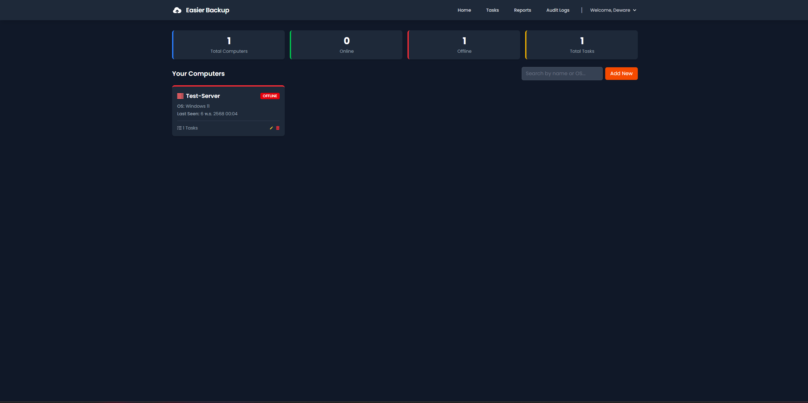
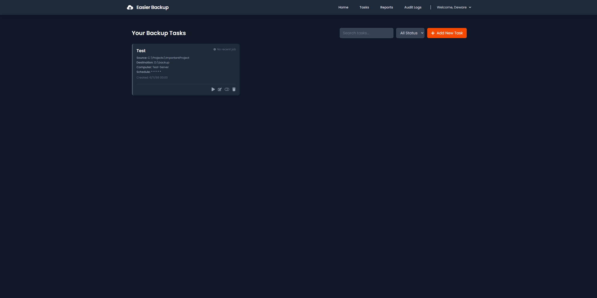
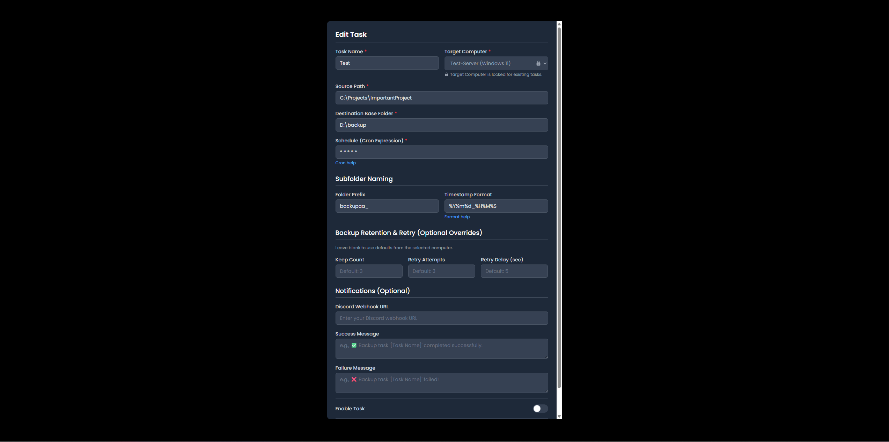
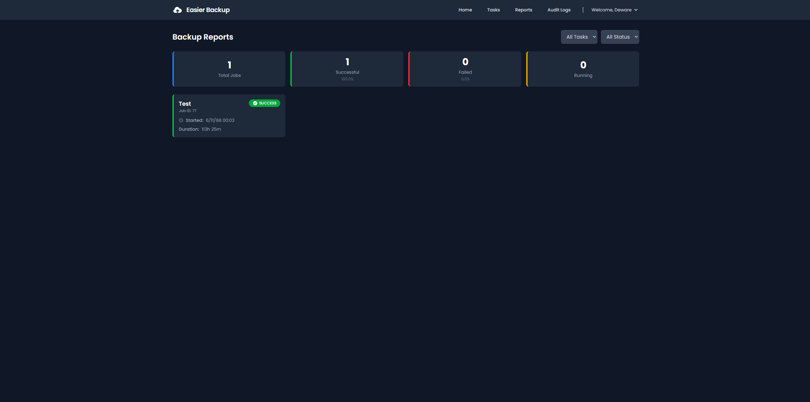

# Easier Backup (Web Frontend)

This is the official web frontend for the Easier Backup system. It's a [Next.js](https://nextjs.org/) application built with [TypeScript](https://www.typescriptlang.org/) and styled using [Tailwind CSS](https://tailwindcss.com/)**.

This client provides a responsive user interface for managing the backend, allowing users to register, monitor agents, and configure backup tasks from any device.

## 📸 Screenshots

*(This section is a placeholder for your images. You will need to add the images to your repository (e.g., in a `docs/` folder) and update the paths here.)*

| Home Dashboard (Home.png) | Task Management (Task.png) |
| :---: | :---: |
|  |  |

| Task Editor Dialog (Task-Dialog.png) | Job Reports (Reports.png) |
| :---: | :---: |
|  |  |

## ✨ Features

* **Secure User Authentication:** Full auth flow including Login, Register, and Forgot Password (using recovery codes).
* **Password Recovery:** A dedicated page for users to generate and view their secure, one-time-use recovery codes.
* **Home Dashboard:** A central dashboard showing an overview of system statistics and a grid of all registered computers (agents).
* **Agent Management:** View all agents, their OS, and real-time online/offline status.
* **Full Task Management:** A dedicated page to view all backup tasks across all agents.
* **Interactive Task Dialog:** A comprehensive dialog to Create and Edit tasks, including scheduling (cron), retention policies, notifications, and path settings.
* **Job Reports:** A detailed view of historical backup jobs, showing status (success/failure), timestamps, and error details.
* **Admin Audit Logs:** (Admin only) A paginated view of all critical system actions for security auditing.
* **Session Management:** Protected routes via Next.js Middleware and automatic logout via a session watcher.

---

## 🛠️ Tech Stack

This project uses the following main technologies:

* **Framework:** Next.js (App Router)
* **Language:** TypeScript
* **UI:** React
* **Styling:** Tailwind CSS (pure, no component library)
* **Form Management:** React Hook Form
* **Data Fetching:** SWR (useSWR)
* **Charts:** Recharts
* **Linting/Formatting:** ESLint & Prettier

---

## 🔒 Security Configuration

This project is designed to be secure by default.

* **No Hardcoded Secrets:** There are no API keys, tokens, or other secrets hardcoded in the repository.
* **Environment Variables:** All sensitive information (like production API URLs) should be stored in `.env.local`, which is explicitly ignored by Git.
* **Relative API Paths:** The app uses relative paths (e.g., `/api/v1/...`) for API calls. This assumes the frontend is served behind a reverse proxy on the same domain as the backend, which is the most secure setup as it prevents CORS issues.

---

## 📄 License

This project is licensed under the **Apache License 2.0**.
